# Wadah Desktop - AI Agent Management Platform

<p align="center">
  
</p>

<p align="center">
  <strong>A beautiful desktop application for building, managing, and distributing AI agents</strong>
</p>

<p align="center">
  <a href="#features">Features</a> •
  <a href="#screenshots">Screenshots</a> •
  <a href="#installation">Installation</a> •
  <a href="#usage">Usage</a> •
  <a href="#development">Development</a>
</p>

---

## 🎯 Overview

Wadah Desktop is an Electron-based desktop application that provides a modern, intuitive interface for managing AI agents powered by the [Wadah Engine](https://github.com/devwadahai/wadah-engine). Build, test, package, and distribute your AI agents with ease.

### 🚦 Feature Status

| Feature | Status | Notes |
|---------|--------|-------|
| Agent Management | ✅ Production | Create, manage, run agents |
| Registry Integration | ✅ Production | Push/pull to OCI registries |
| Templates & Builder | ✅ Production | 6+ production-ready templates |
| Settings & Config | ✅ Production | API keys, environment variables |
| **x402 Payments** | 🚧 **WIP** | **UI complete, payment execution mock** |
| Wallet Connection | ✅ Working | Real Web3 wallet integration |
| Agent Marketplace | 🚧 WIP | UI done, needs real payment flow |
| Revenue Dashboard | 🚧 WIP | UI only, mock data currently |

> **⚠️ Important**: The x402 crypto payment features show a **complete UI** with **working wallet connections**, but actual payment execution currently uses **mock transactions**. Real USDC payments require additional CDP API setup (~4-6 hours). See [x402 Status](#x402-payment-status) for details.

## ✨ Features

### 🤖 Agent Management
- **Create New Agents** from production-ready templates
- **Browse & Manage** all your agents in one place
- **Run Agents** with real-time output
- **Package Agents** into distributable `.wpkg` files

### 💰 x402 Crypto Payments (🚧 WIP - Infrastructure Ready)
- **Pay-per-Execution** model for premium agents (UI ready, payment execution WIP)
- **Wallet Integration** - Coinbase Wallet, MetaMask, WalletConnect ✅ Working
- **Multi-Chain Support** - Base, Ethereum, Base Sepolia ✅ Working
- **Agent Marketplace** - Browse and run paid AI agents (UI complete, real payments WIP)
- **Revenue Dashboard** - Track earnings from your paid agents (UI only, mock data)
- **USDC Payments** - Low-fee transactions on Base network (Integration WIP)

> **⚠️ Status**: Full infrastructure and UI complete. Wallet connection works. Payment execution uses mock transactions currently. Real x402 payment flow requires Coinbase CDP API keys and contract integration (~4-6 hours to implement).

### 📦 Registry Integration
- **Push to OCI Registries** (GitHub Container Registry, Docker Hub, custom)
- **Pull from Registries** to share agents across teams
- **Docker Credential Support** - seamless authentication
- **Package Management** - view and organize local packages

### 🎨 Beautiful UI/UX
- **Modern Design** with shadcn/ui components
- **Dark/Light Mode** support
- **Real-time Feedback** for all operations
- **Responsive Layout** that works on any screen size

### 🔐 Security & Configuration
- **Environment Variable Management** - securely store API keys
- **Persistent Storage** - settings saved across sessions
- **Recent Runs History** - quick access to previous executions
- **Workspace Management** - organized file structure

### 📊 Dashboard
- **Real-time Statistics** - agents, runs, templates
- **Quick Actions** - jump to any feature
- **System Health** - CLI connection status
- **Recent Activity** - track your latest runs

## 📸 Screenshots

> A complete walkthrough of Wadah Desktop's features

### 1. Dashboard - Your Command Center

*Start here: Overview of your agents, templates, and recent activity with quick access to all features*

### 2. Agents - Manage Your AI Workforce
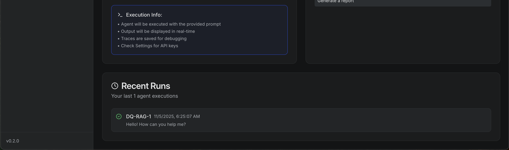
*View, search, and manage all your AI agents with status indicators and quick actions*

### 3. Agent Builder - Create with Templates
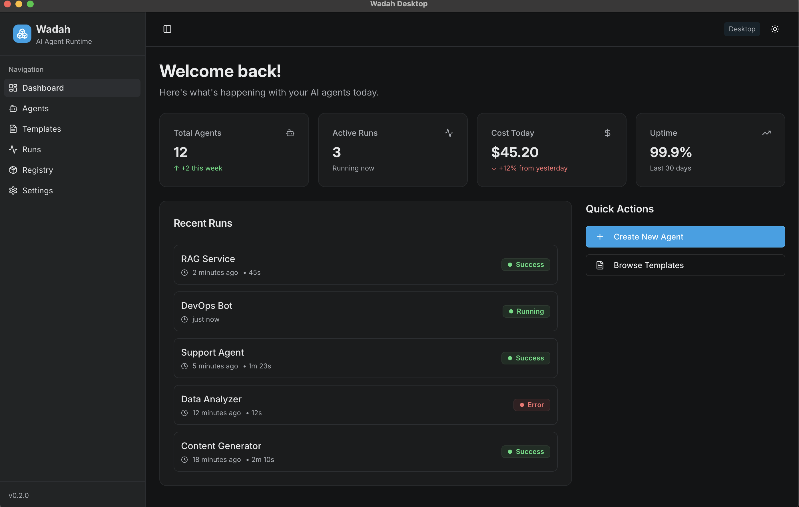
*Build new agents from production-ready templates: customer support, RAG systems, DevOps bots, and more*

### 4. Agent Details - Configure & Customize
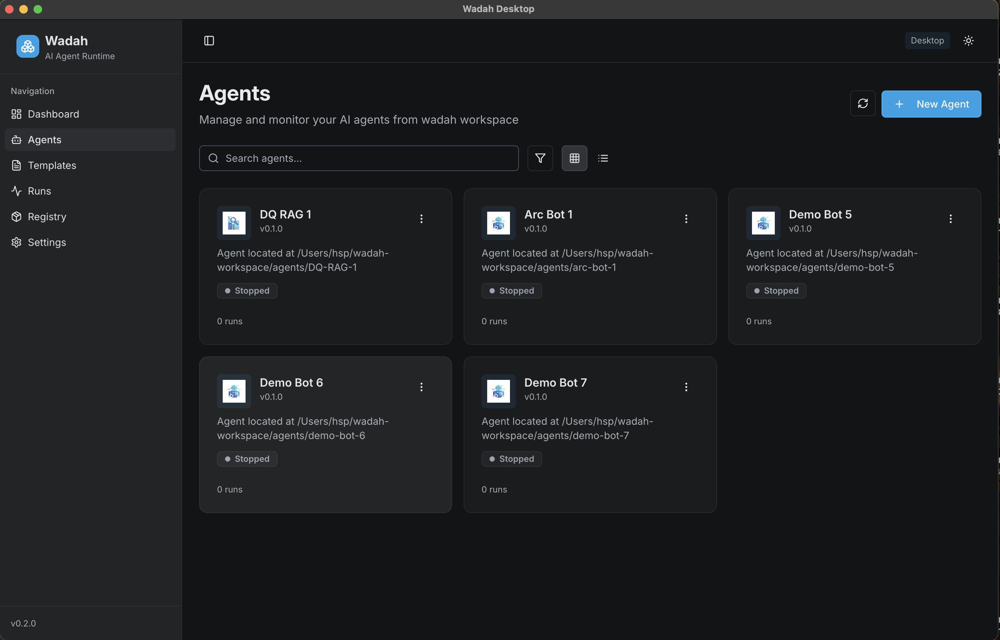
*Fine-tune your agent: model selection, security settings, prompts, and advanced configurations*

### 5. Templates Library
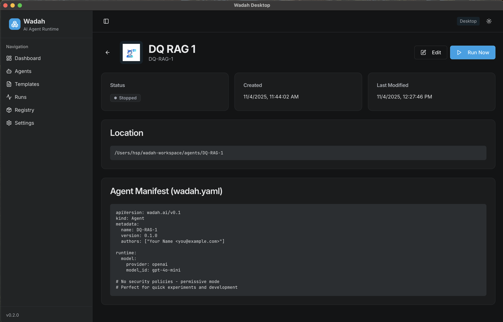
*Explore 6+ production-ready templates spanning customer support, data analysis, RAG systems, and automation*

### 6. Template Details - Preview Before Creating
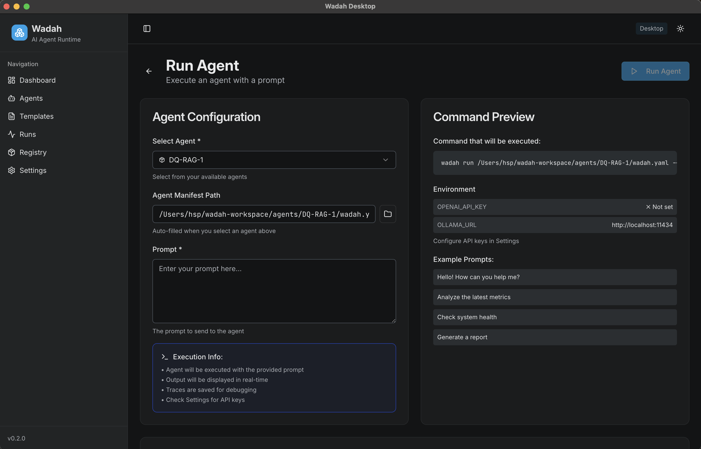
*Read documentation, understand the template structure, and clone to start building*

### 7. Run Agent - Execute & Test
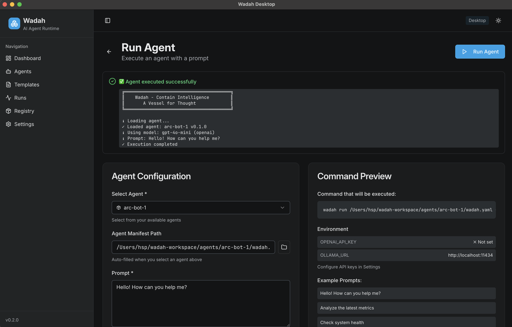
*Run your agents with custom prompts, view environment status, and access recent run history*

### 8. Real-time Output - See Results Live
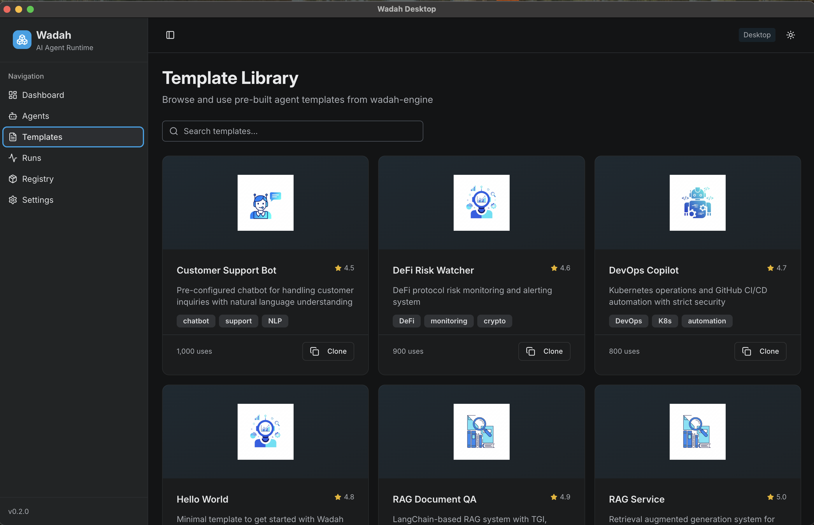
*Watch your agent execute in real-time with streaming output, cost tracking, and execution details*

### 9. Registry - Package Management
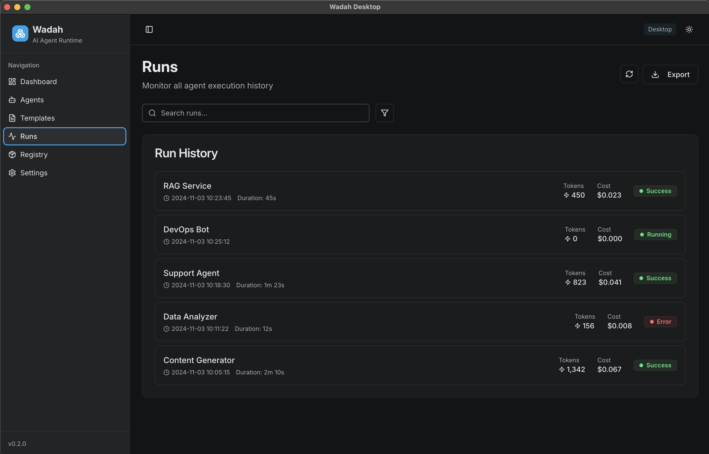
*Manage local .wpkg packages, push to OCI registries, and pull shared agents from the community*

### 10. Create Package - Build for Distribution
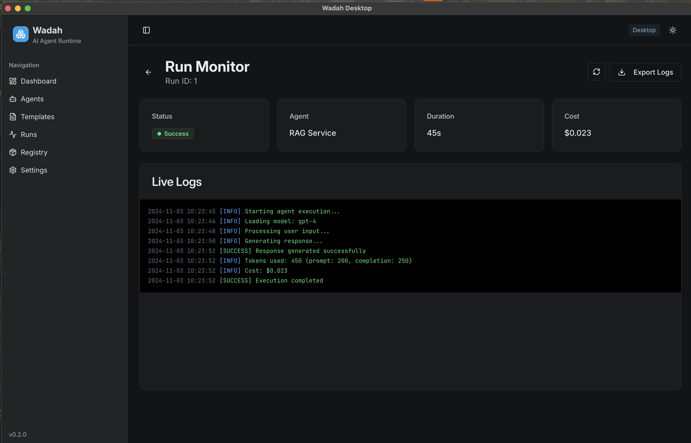
*Select an agent and package it into an OCI-compliant .wpkg file ready for distribution*

### 11. Push to Registry - Share Your Agents
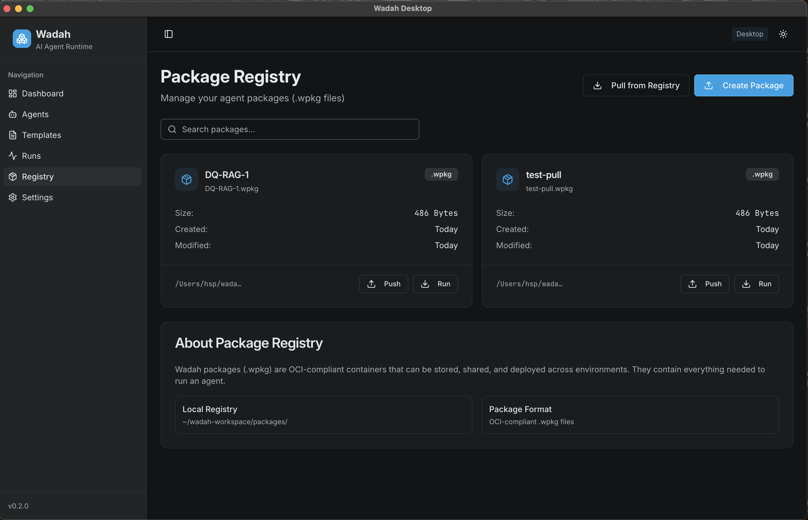
*Push packages to GitHub Container Registry, Docker Hub, or any OCI-compliant registry with Docker credential support*

### 12. Pull from Registry - Import Shared Agents
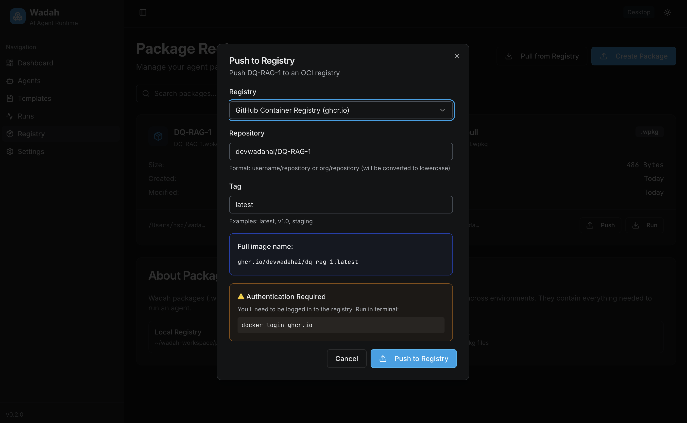
*Pull packages from registries to share agents across teams or use community-created agents*

### 13. Settings - Configure Your Environment
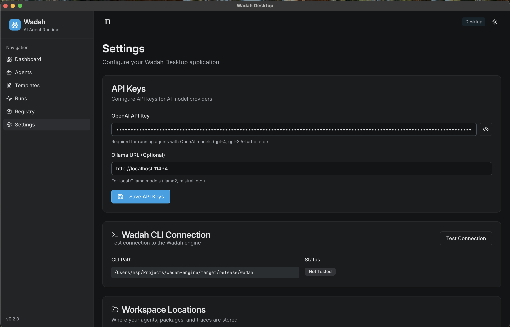
*Manage API keys (OpenAI, Anthropic, Ollama), test CLI connection, and view workspace locations*

### 14. Marketplace - Browse Paid Agents (🚧 WIP)

*Explore premium AI agents with x402 crypto payments - UI complete, payment execution uses mock transactions (real payments WIP)*

### 15. Wallet Connection - Web3 Integration (✅ Working)

*Connect your wallet (Coinbase Wallet, MetaMask, WalletConnect) - fully functional wallet integration with real blockchain connections*

## 🚀 Installation

### Prerequisites

- **Node.js** 18+ and npm
- **Wadah CLI** installed and available in PATH
  ```bash
  # Install Wadah Engine
  cargo install wadah-cli
  # Or download from releases
  ```

### Quick Start

```bash
# Clone the repository
git clone https://github.com/devwadahai/wadah-ui.git
cd wadah-ui

# Install dependencies
npm install

# Run in development mode
npm run dev:electron
```

### Building for Production

```bash
# Build the Electron app
npm run build:electron

# Package for your platform
npm run dist           # Current platform
npm run dist:mac       # macOS
npm run dist:win       # Windows
npm run dist:linux     # Linux
```

The built application will be in the `release/` directory.

## 💻 Usage

### First Time Setup

1. **Launch Wadah Desktop**
2. **Go to Settings** and configure your API keys:
   - `OPENAI_API_KEY` for OpenAI models
   - `ANTHROPIC_API_KEY` for Claude models
   - `OLLAMA_URL` for local models (optional)
3. **Test Connection** to verify Wadah CLI is accessible

### Creating Your First Agent

1. Navigate to **Agent Builder**
2. Choose a template (hello-world, customer-support, RAG, etc.)
3. Configure your agent:
   - Select model (GPT-4, Claude, Ollama)
   - Set security level
   - Customize settings
4. Click **Create Agent**

### Running an Agent

1. Go to **Run Agent** page
2. Select your agent from the dropdown
3. Enter a prompt
4. Click **Run Agent**
5. View real-time output

### Packaging & Distribution

1. Navigate to **Registry** page
2. Click **Create Package**
3. Select an agent to package
4. Click **Create Package**
5. Optionally **Push to Registry**:
   - Choose registry (ghcr.io, docker.io)
   - Enter repository name
   - Set tag (latest, v1.0, etc.)
   - Click **Push to Registry**

## 🛠️ Development

### Project Structure

```
wadah-ui/
├── client/              # React frontend
│   ├── src/
│   │   ├── components/  # UI components
│   │   ├── pages/       # Page components
│   │   └── lib/         # Utilities
│   └── index.html
├── electron/            # Electron main & preload
│   ├── main/           # Main process
│   └── preload/        # Preload scripts
├── server/             # Express backend (web mode)
└── package.json
```

### Tech Stack

- **React 18** - UI framework
- **TypeScript** - Type safety
- **Electron 28** - Desktop framework
- **Vite** - Build tool
- **TanStack Query** - Data fetching
- **shadcn/ui** - UI components
- **Tailwind CSS** - Styling
- **Wouter** - Routing

### Available Scripts

```bash
# Development
npm run dev              # Web mode
npm run dev:electron     # Electron mode

# Building
npm run build            # Web build
npm run build:electron   # Electron build

# Packaging
npm run pack             # Build without packaging
npm run dist             # Full distribution build
```

### IPC Handlers

The app communicates with Wadah CLI through Electron IPC:

- `wadah:init` - Create new agent
- `wadah:run` - Execute agent
- `wadah:pack` - Package agent
- `wadah:push-package` - Push to registry
- `wadah:pull-package` - Pull from registry
- `wadah:list-agents` - Get all agents
- `wadah:get-templates` - Get available templates
- `wadah:save-env` - Save environment variables
- `wadah:get-env` - Retrieve environment variables

## 📁 Workspace Structure

Wadah Desktop uses a consistent workspace structure:

```
~/wadah-workspace/
├── agents/              # Agent source code
│   ├── my-bot-1/
│   │   ├── wadah.yaml
│   │   ├── prompts/
│   │   └── memory/
│   └── my-bot-2/
├── packages/            # Built .wpkg packages
│   ├── my-bot-1.wpkg
│   └── my-bot-2.wpkg
└── traces/             # Execution traces
```

Environment variables are stored in:
```
~/Library/Application Support/wadah-desktop/env-config.json  # macOS
~/.config/wadah-desktop/env-config.json                      # Linux
%APPDATA%/wadah-desktop/env-config.json                      # Windows
```

## 🚧 x402 Payment Status

### What's Working ✅

**Backend (Rust - 100% Complete)**:
- ✅ Full x402 protocol implementation
- ✅ Payment verification logic
- ✅ Facilitator client for Coinbase CDP
- ✅ `wadah serve` CLI command
- ✅ All 7/7 unit tests passing

**Frontend (React/Electron - UI Complete)**:
- ✅ Wallet connection (Coinbase Wallet, MetaMask, WalletConnect)
- ✅ Real Web3/blockchain integration via wagmi
- ✅ Multi-chain support (Base, Ethereum, Sepolia)
- ✅ Complete marketplace UI
- ✅ Payment dialog UI
- ✅ Revenue dashboard UI

### What's Mock/WIP ⚠️

**Payment Execution**:
- ⚠️ Payment button triggers mock 2-second delay
- ⚠️ Generates fake transaction hash
- ⚠️ No actual USDC transfer occurs
- ⚠️ No blockchain transaction submitted

**Revenue Tracking**:
- ⚠️ All earnings data is hardcoded
- ⚠️ Transaction history is fake
- ⚠️ No real blockchain event queries

### To Complete (Est. 4-6 hours) 🔨

1. **Get Coinbase CDP API Keys**:
   - Sign up at https://portal.cdp.coinbase.com
   - Create API key and secret

2. **Implement Real Payment Flow**:
   - EIP-3009 `transferWithAuthorization` signature
   - USDC contract interaction via viem
   - Transaction submission and confirmation
   - Error handling and user feedback

3. **Add Revenue Tracking**:
   - Query USDC Transfer events
   - Parse and display real transaction data
   - On-chain balance verification

4. **Testing**:
   - Test on Base Sepolia with testnet USDC
   - Verify end-to-end payment flow
   - Production deployment

### Documentation

For complete implementation details, see:
- Backend: `/wadah-engine/docs/X402_IMPLEMENTATION_SUMMARY.md`
- Protocol: `/wadah-engine/docs/X402_INTEGRATION_PLAN.md`
- CDP Guide: `/wadah-engine/docs/X402_CDP_INTEGRATION.md`

## 🤝 Contributing

Contributions are welcome! Please feel free to submit a Pull Request.

1. Fork the repository
2. Create your feature branch (`git checkout -b feature/amazing-feature`)
3. Commit your changes (`git commit -m 'Add some amazing feature'`)
4. Push to the branch (`git push origin feature/amazing-feature`)
5. Open a Pull Request

## 📄 License

Apache 2.0 - see the [LICENSE](LICENSE) file for details.

## 🔗 Links

- **Wadah Engine**: [github.com/devwadahai/wadah-engine](https://github.com/devwadahai/wadah-engine)
- **Documentation**: See [wadah-engine/docs](https://github.com/devwadahai/wadah-engine/tree/main/docs)
- **Templates**: See [wadah-engine/templates](https://github.com/devwadahai/wadah-engine/tree/main/templates)

## 💬 Support

For questions, issues, or feature requests:
- Open an issue on [GitHub](https://github.com/devwadahai/wadah-ui/issues)
- Check the [documentation](https://github.com/devwadahai/wadah-engine/tree/main/docs)

---

<p align="center">
  Built with ❤️ using React, TypeScript, and Electron
</p>
